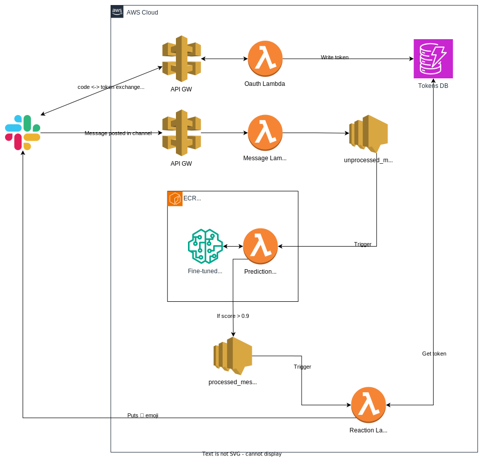

## About

Slack app that looks for messages in specific channel, detects if someone is asking for a sick leave and puts 🍀 emoji to that message. Uses XLM Roberta model which was fine-tuned with custom & augmented by ChatGPT data. Infrastructure defined in code using CDK and deployed to AWS as multiple Lambdas which communicate between each other using SNS

<a href="https://slack.com/oauth/v2/authorize?client_id=14913796932.5867082748166&scope=channels:history,reactions:read,reactions:write,chat:write&user_scope="></a>

## Overview of development

TL;DR, what was accomplished during working on this pet project:
1. Data was gathered from Slack & filtered-out. Also more data was augmented by ChatGPT. Datasets were prepared
2. Fine-tuned XLM Roberta base model with my data
3. Small microservices architecture was designed consisting of multiple lambdas which are responsible for: a) Slack app install via oauth b) Incoming messages handling c) Predictions calculation for each message d) Reacting to message

#### Code structure

The source is organized using the following structure:

```
src
├── data
├── inference
│   ├── ... (folder for each lambda)
├── infrastructure
│   ├── main.py
└── models
```

The `data` directory contains scripts for data fetching, filtering, generation & data sets preparation

The `inference` directory contains folders with sources for each lambda

The `infrastructure` directory contains `main.py` file where the whole infrastructure is define in code using CDK

And the `models` directory contains `train_model.ipynb` notebook file where model fine-tuning process was performed

Read below for more info

### Data preparation for training

#### 1. Getting already labeled data in Slack

In my case data was already labeled by people using 💊 reaction in Slack. So I had to go to Slack settings -> Export data and wait while Slack generates archive. After I wrote a simple script to parse exported json files: [slack_data_parser.py](src/data/slack_data_parser.py) and fetch all messages with 💊

#### 2. Getting more data

More data for training = better. Also there is no messages in slack where people saying they're NOT sick. So I needed more variants to make my training set balanced. I used ChatGPT API ($18 free-tier is enough for this) to generate it. I've introduced small script for this [generate_data.py](src/data/generate_data.py), here is how to use it:

1. Set `OPENAI_API_KEY` env var to your key
2. Call [generate_data.py](src/data/generate_data.py) with such args: `sick/not_sick` (type of data to generate) and count of messages. Example: `python generate_data.py sick 100`

#### 3. Creating sets for training and testing

Using [make_dataset.py](src/data/make_dataset.py) I generated training csv file with such headers `text` and `label` where label is 0 or 1 depending or data type. And 10% of data saved to separate file for testing purposes to verify later how to our model works which we'll fine-tune in the next step

### Model fine-tuning

To make NLP classification model I used transformers approach. I took a pre-trained model and then fine-tuned it using transfer learning. My dataset is multilingual (contains messages in Engligh, Russian and Polish), so as a base model I used https://huggingface.co/xlm-roberta-base which is amazing fit since using bigger LLMs is the overkill for such simple prediction task

See [train_model.ipynb](src/models/train_model.ipynb) notebook for more details about the fine-tuning process

After fine-tuning & evaluating model on my data, I pushed it to the Hugging Face: https://huggingface.co/kamilhism/xlm-roberta-base-finetuned-sick-leave-detector

### Application design



1. [oauth_lambda.py](src/inference/oauth/oauth_lambda.py) with API gateway is responsible for saving access tokens. When users install app to their workspaces, Slack sends request to specified API gateway url with code, Lambda exchanges this code to an access_token which is being saved to DynamoDB
2. [message_lambda.py](src/inference/message/message_lambda.py) with API gateway is responsible for event subscription. When message is being posted to some channel, Slack sends request to specified API gateway route with all message info. Lambda handles this request and publish message to `unprocessed_messages` SNS
3. `unprocessed_messages` SNS event is the trigger for [prediction_lambda.py](src/inference/prediction/prediction_lambda.py). Lambda is being called with all info from the event. It loads model & tokenizer, sets up text-classification pipeline and calculate predictions. If message met required score, it's being pushed further to the `processed_messages` SNS
4. [reaction_lambda.py](/src/inference/reaction/reaction_lambda.py) is being trigerred by `processed_messages` SNS, it fetched access token saved in step#1 to DynamoDB and using it sends `reactions.add` requests

### Deploying application

Infrastructure defined in code using CDK: [src/infrastructure/main.py](src/infrastructure/main.py). So basically to deploy this whole app need to just run inside infrastructure folder: `cdk bootstrap` and `cdk deploy`

## Demo


